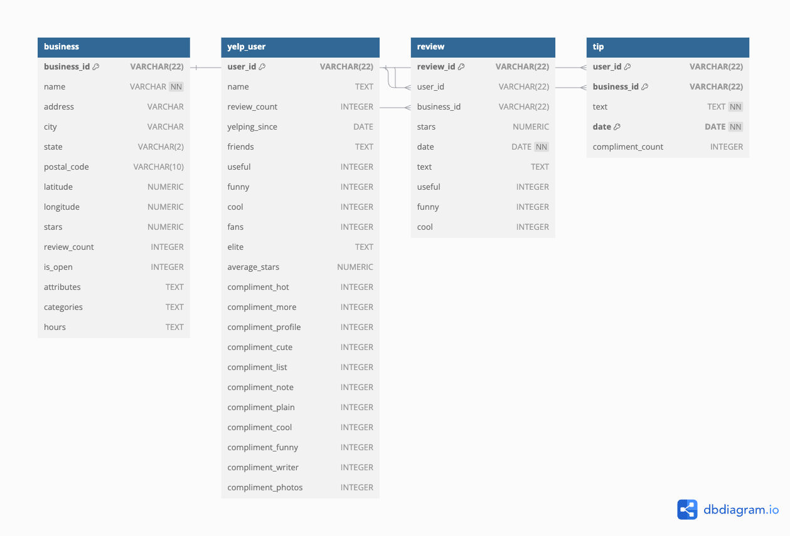
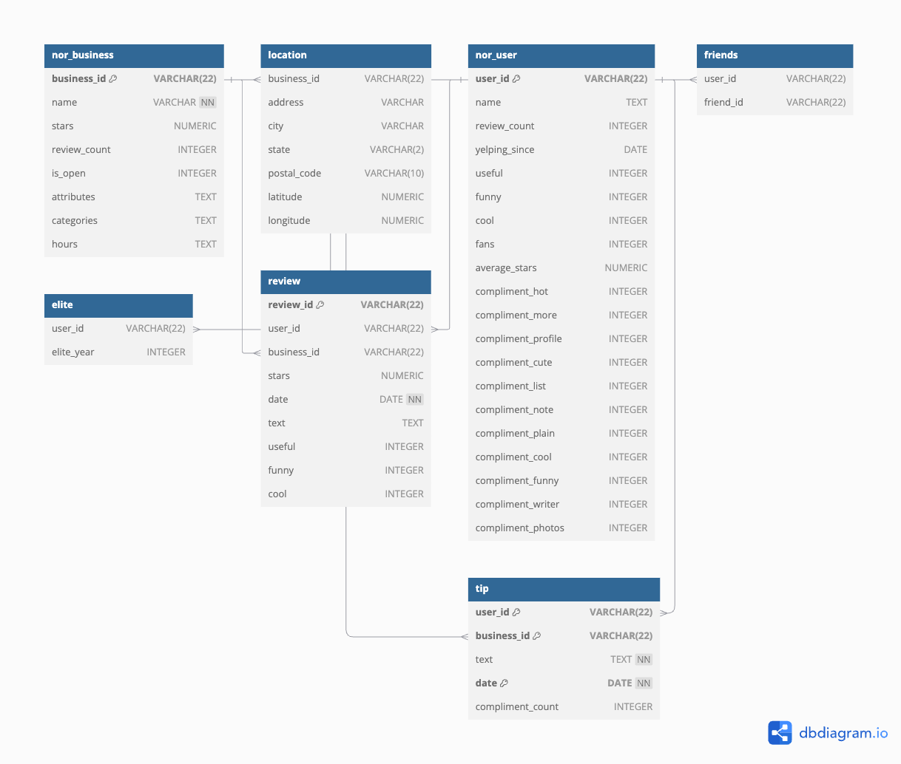

# Final Implementation Project

## Getting Hands Dirty with PostgreSQL
For this project, I focused on concepts from part of **class 6** and **class 7**, which covered **relational database management systems (RDBMS)**. This project explores three main areas: 
1. **Schema Design (Normalization vs. Denormalization)**
2. **SQL Query Optimization**
3. **Exploratory and Analytical Queries**
   
## Dataset Selection
The Yelp Dataset is an open-source dataset that contains information about restaurants, reviews, user info, and more across the US. Since the dataset is very large, totaling around **9.29 GB**, I decided to sample the data to make it more manageable for analysis and storage.

---

## System and Database Setup
To set up the system, I installed **PostgreSQL** locally using the **brew command line**. I also installed essential packages like **psycopg3**, **random**, **json**, and **pandas**. After that, I downloaded the Yelp dataset and utilized a **sampling method** to reduce its size while maintaining the structure necessary for foreign key constraints. The sampled data is stored as **CSV files** in the `sampled_data/` directory. 

### Sampling Method
Given the size of the dataset, I initially sampled **10,000 rows** of the `business` data. However, since other datasets like `user`, `review`, and `friend` are scaled according to the `business` table, the data quickly grew to over **30 million rows**. This was too large to upload to GitHub. To resolve this, I resampled the `business` data to **only 1,000 rows**. 

To maintain foreign key constraints, I started with the **business table** by sampling 1,000 business IDs. Then, I used these **business IDs** to sample data for **user**, **review**, and **tip** datasets. 

**Sampling Algorithm:**  
I used **reservoir sampling** because it produces a **Simple Random Sample (SRS)** and runs in **O(n) time**. This algorithm allows for a fixed sample size **(k = 1000)** while iterating through the entire dataset.  
- For the first **k rows**, they are automatically included in the sample.  
- For every row after the first **k**, a random number `j` is generated between **0 and current row index**.  
  - If **j < k**, then the current row replaces the j-th row in the sample.  
  - If **j >= k**, the current row is skipped.  

This ensures that each row in the dataset has a **k/n chance** of being included in the sample. The proof for this can be done using **mathematical induction**.

---

## Part 1: Analysis of Normalized vs. Denormalized Data
In this section, I explore the difference between **normalized** and **denormalized** data, highlighting their respective advantages and disadvantages. 

- **Denormalized Data**: Here, I directly used the data as it was fetched from the JSON file.  
- **Normalized Data**: I designed a normalized schema by factoring out location information such as **latitude, longitude, city, state, and postal code** into a **Location table**. Similarly, I created a separate **Friends table** and an **Elite table** from the User data to avoid redundant and NULL values.

### ER Diagrams
The ER diagrams for both denormalized and normalized versions:

### Design Decisions
- For **each relation**, I set constraints like **primary keys** and **foreign keys** to ensure **referential integrity**.
- For the **business table**, I separated out location data (city, state, etc.) into a separate **Location table**.
- For the **user table**, I split the **elite column** into a new **Elite table** because it had many NULL values. I also split **Friends** into a separate table for better query performance.

### Comparative Analysis
I compared the **query performance** for the following queries on both **normalized** and **denormalized** data: 
1. **Top 5 Cities with the Most 5-Star Businesses**
2. **Which Years Had the Most Elite Users?**
3. **Businesses Open in Multiple States**
4. **Users with the Most Friends**

Using **EXPLAIN ANALYZE**, I analyzed the **execution time** and saw which **scan types** and **join types** were used. My key takeaway is that **normalized data performs worse** when joins are required since it has to combine data from multiple tables. However, normalization is beneficial when updating or deleting records, as it minimizes redundancy.

---

## Part 2: Query Optimization Analysis
In this part, I explored **query optimization techniques** like **views**, **predicate pushdown**, and **indexes**. 

### Techniques Used

1. **Views**:  
   I created a materialized view to find the **top 5 cities with the most 5-star businesses**.  
   - I compared the runtime of a **plain query**, a **CTE**, a **virtual view**, and a **materialized view**.  
   - Results: 
     - **Materialized view** was the fastest because it precomputes and stores the results.  
     - **Virtual view** was next, as it reuses an underlying query but doesn't precompute.  
     - **CTE** and **plain queries** had the longest runtime since they recompute each time.  

2. **Predicate Pushdown**:  
   To see how **filtering before joining** affects performance, I queried **which users wrote the most reviews in 2021**.  
   - I compared performance with and without a **predicate pushdown**.  
   - Results: 
     - **With pushdown**: Faster since it reduces the size of the dataset before the join.  
     - **Without pushdown**: Slower since it joins all records before filtering.  

3. **Indexes**:  
   I created an index on the **user_id** column to query **users who give the most total number of tips**.  
   - I ran the query with and without an index to observe the difference.  
   - Result: **The indexed version was significantly faster**, as indexes allow PostgreSQL to perform faster lookups instead of scanning the entire table.  

---

## Part 3: Exploratory and Analytical Queries
This part focuses on **data analysis and insights**. I created meaningful queries to explore restaurant recommendations and review analysis.

### Restaurant Recommendations
- **Top 3 Businesses in Each State**: Uses **window functions** and **ROW_NUMBER()**.  
- **Users Who Left Multiple Reviews for the Same Business**: Highlights which users frequently return to the same business.  

### Sentiment Analysis
- **Sentiment Trends Over Time**: Tracks the number of **positive, negative, and neutral reviews** over time.  
- **Impact of Review Length on Ratings**: Uses a **CASE WHEN** statement to classify review length as short, medium, or long and its impact on review rating.  

These queries make use of **CTEs**, **window functions**, **CASE WHEN**, and **date functions**.

---

## Conclusion
This project demonstrates my deeper understanding of **relational database systems**, including schema design, normalization, and query optimization. I applied concepts like **primary keys**, **foreign keys**, **indexes**, and **fata types** to create a robust data model. 

### **Future Work**
- **Use MongoDB**: Since many attributes (like **restaurant attributes** and **categories**) are in **JSON format**, MongoDB (a NoSQL database) would be better suited for this data.  
- **Cloud-Based Solution**: Using **AWS RDS** or **Google Cloud SQL** could handle larger datasets and support larger-scale queries.  
- **More Advanced Analysis**: I could further explore **machine learning models** on this data, like **restaurant recommendation models** using collaborative filtering or **sentiment analysis** on customer reviews.  

